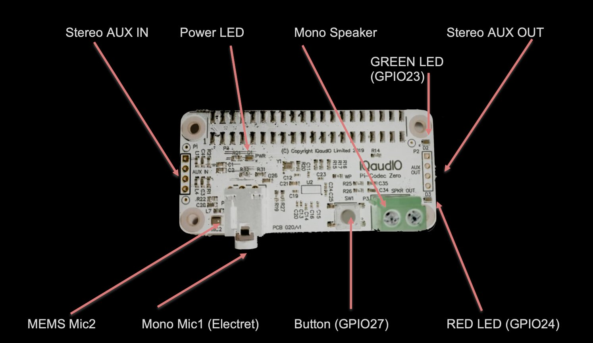
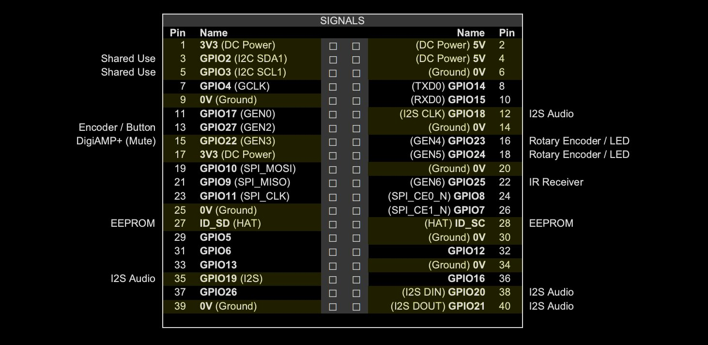

## IQaudio Codec Zero



### Gettings Started 

[Source - Page 11](https://datasheets.raspberrypi.org/iqaudio/iqaudio-product-brief.pdf)

Codec Zero is a Raspberry Pi Zero sized board but it also includes the HAT EEPROM allowing for auto configuration of the Linux environment if needed.

The Codec Zero delivers bi-directional digital audio signals (I2S) between the Raspberry Pi and onboard Dialog Semiconductor DA7212. Supporting a range of input and output devices from built in MEMS microphone, mono Electret microphone or mono speaker (1.2W / 8Ω).

IQaudio Codec Zero has GREEN (GPIO23) and RED (GPIO24) LEDs that can be used for status, and a tactile button (GPIO27) that can be used to start an event. Codec Zero makes a great starting point for a walkie talkie, intelligent doorbell, vintage radio hack, or smart speaker.

#### Adding the IQaudio sound card to your Raspberry Pi

[Source - Page 11](https://datasheets.raspberrypi.org/iqaudio/iqaudio-product-brief.pdf)

> WARNING: PLEASE ENSURE ALL POWER CABLES ARE DISCONNECTED FROM THE RASPBERRY PI BEFORE ATTEMPTING THIS PROCEDURE.

The IQaudio range of sound cards attach to the Raspberry Pi’s 2x20 way pin header (GPIO header).

They are designed to be supported on the Pi using the supplied PCB standoffs and screws. In general no soldering is required to the IQaudio boards for normal operation.

The IQaudio range of boards are normally supplied with the necessary mounting hardware (PCB spacers and screws), these are for our latest low profile boards 4x 9mm PCB spacers and 8x M2.5 screws. If additional parts (such as 2piece speaker connectors) are required these are normally provided too.  

### GPIO usage / Pin headers

Qaudio range of sound cards for the Raspberry Pi take advantage of a number of Pi signals in order to operate successfully. 

Some of these signals are solely for the use of the IQaudio board and some can be shared with other peripherals, sensors, etc. 

The information below covers the general cases. For more Raspberry Pi GPIO information please see the excellent site: [https://pinout.xy](https://pinout.xy)

We expect the following Raspberry Pi GPIO to be used by IQaudio audio boards:

- ALL POWER PINS
- ALL GROUND PINS
- GPIO 2/3 (I2C)
- GPIO 18/19/20/21 (I2S)

If appropriate then the following are also used:

- GPIO 22 (DigiAMP+ mute / unmute support)
- GPIO 23/24 for Rotary Encoder (physical volume control) or status LED (Codec Zero)
- GPIO 25 for the IR Sensor.
- GPIO 27 for the Rotary Encoder push switch / Code Zero switch



### Configuring Linux for the IQaudio sound card

[Source - Page 5](https://datasheets.raspberrypi.org/iqaudio/iqaudio-product-brief.pdf)

All our latest full size audio boards include a pre-programmed EEPROM. This allows Raspberry Pi OS to auto detect and auto configure itself allowing the IQaudio boards to be plug and play.

If you need to configure Raspberry Pi OS yourself, you can edit the boot configuration file (found at /boot/config.txt) to manually add the appropriate device-tree overlay:

```
// /boot/config.txt
dtoverlay=iqaudio-codec
```

#### Disabling the standard Raspberry Pi On-Board Audio

To make your IQaudio sound card the primary audio device in Raspberry Pi OS you will need to disable the Raspberry Pi’s on-board audio card. 

This is done simply by commenting out the `dtparam=audio=on` device tree parameter on your sd card’s `/boot/config.txt` file by placing a # at the start of the line, saving the file and rebooting your Pi.

`/boot/config.txt` should have the following entry to disable the Pi’s on-board sound card.

```
#dtparam=audio=on
```
